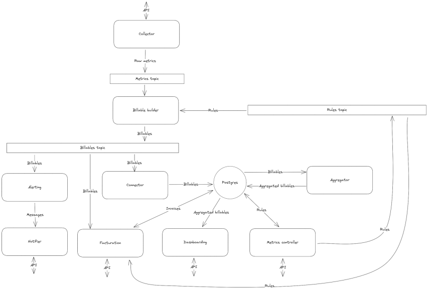

<!-- Screenshots -->
# :building_construction: Architecture

- [:building\_construction: Aster architecture](#aster-architecture)
- [:abacus: Billable builder](#abacus-billable-builder)
    - [Init flow](#init-flow)   

<!-- Aster architecture -->
## :building_construction: Aster architecture

 
  

<!-- Billable builder -->
## :abacus: Billable builder

The billable builder is responsible for transforming the metrics into chargeable data. It is composed of a set of rules that are applied to the metrics.

### Init flow

When the billable builder is initialized, it should load the rules to apply to the metrics to transform them into Billables.

For that, it should:

1.Read the rules updates in the rule topic.  
2.Call the rule controller to get the rules saved in database.  
3.Receive the rules.  
4. Merge the rules based on id and version.

